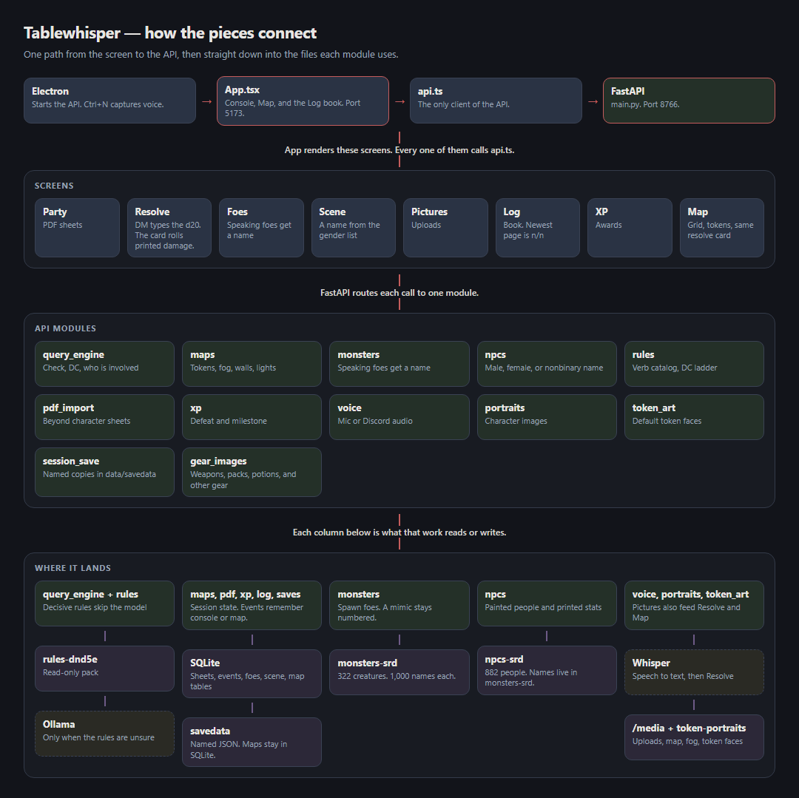

# Tablewhisper

Local DM console for D&D 5e: Beyond PDF sheets, whispered rulings, SRD combat foes, tavern Scene NPCs, optional voice (Ctrl+N) + Ollama. Runs fully local.

**Use Command Prompt (`cmd`), not PowerShell** — avoids script-policy errors with `Activate.ps1` / `npm.ps1`.

Open cmd: Start → type `cmd` → Enter.

## How it connects



Boxes run in one direction: the screen calls the API, FastAPI hands each request to a module, and the columns underneath are the files or tools that module uses. The same diagram as code is [ARCHITECTURE.html](ARCHITECTURE.html) — open it in a browser.

Project folder used below:

```bat
G:\Discord Bot\DND DM Dice roll bot
```

---

## Prerequisites (once)

- Python 3.11+ — [python.org](https://www.python.org/downloads/) (check **Add to PATH**)
- Node.js 20+ LTS — [nodejs.org](https://nodejs.org/)
- Ollama (optional) — [ollama.com](https://ollama.com) then `ollama pull llama3.2`

---

## First-time setup (once)

```bat
cd /d "G:\Discord Bot\DND DM Dice roll bot\apps\api"
rmdir /s /q .venv
python -m venv .venv
.venv\Scripts\python.exe -m pip install --upgrade pip
.venv\Scripts\python.exe -m pip install -r requirements.txt

cd /d "G:\Discord Bot\DND DM Dice roll bot\apps\desktop"
npm install
```

No `Activate.ps1`. Always call `.venv\Scripts\python.exe` directly.

---

## Launch

### Easiest — double-click

```
start-dev.bat
```

Menu:

| Option | What |
|--------|------|
| **1** | Start API + UI in the background and open the browser once. Logs: `data\logs` |
| **2** | First-time setup (venv + npm) |
| **3** | Show commands |
| **4** | Health check |
| **5** | Discord VC bot (local only; not in this repo) |
| **6** | Quit — stops the API and UI and frees ports |

### Manual — two cmd windows

**Window 1 — API**

```bat
cd /d "G:\Discord Bot\DND DM Dice roll bot\apps\api"
.venv\Scripts\python.exe -m uvicorn app.main:app --host 127.0.0.1 --port 8766 --reload
```

**Window 2 — UI**

```bat
cd /d "G:\Discord Bot\DND DM Dice roll bot\apps\desktop"
npm run dev:ui
```

Open: **http://127.0.0.1:5173**

### Electron (Ctrl+N hotkey)

With API already running in Window 1:

```bat
cd /d "G:\Discord Bot\DND DM Dice roll bot\apps\desktop"
npm run dev
```

Or build then run:

```bat
cd /d "G:\Discord Bot\DND DM Dice roll bot\apps\desktop"
npm run build
npm start
```

---

## If you insist on PowerShell

Don’t activate the venv. Don’t rely on `npm` (it hits `npm.ps1`).

```powershell
cd "G:\Discord Bot\DND DM Dice roll bot\apps\api"
.\.venv\Scripts\python.exe -m uvicorn app.main:app --host 127.0.0.1 --port 8766 --reload
```

```powershell
cd "G:\Discord Bot\DND DM Dice roll bot\apps\desktop"
npm.cmd run dev:ui
```

Optional (allows scripts for your user only):

```powershell
Set-ExecutionPolicy -Scope CurrentUser RemoteSigned
```

---

## Health check

```bat
curl http://127.0.0.1:8766/health
```

Or in a browser: http://127.0.0.1:8766/health → `{"status":"ok"}`

---

## Using the app

### Party

1. **Upload PDF** — adds a new D&D Beyond character sheet.
2. **Re-upload** — pick which party member to update **before** the file dialog → review a human-readable change list → **Confirm update**.
   - If the PDF looks like a different character, choose **Upload as new character** instead.
3. **Edit sheet** / **Remove** for manual tweaks.

### Bag

**Open bag** on a party card opens that character's inventory. Drag an item onto a place and it snaps into the grid. A full hand, worn slot, or bag refuses the drop and the item stays where it was.

| Place | What goes there |
|-------|-----------------|
| **Hands** | Left hand and right hand. A two-handed weapon fills both. A thri-kreen also has two light-hand slots. |
| **On person** | Body (armor), shoulders (cloak), belt (a worn one-handed weapon), back (a worn two-handed weapon or shield). |
| **Bag** | Everything else, in the worn container's grid. |

Right-click an item in the bag, or press **R** while it is selected, to turn it a quarter turn. Hands and pockets keep their orientation.

The grid follows the container worn on the body. With no pack listed, it is a backpack: 8 by 4 cells, 30 lb.

| Container | Cells | Pound cap | Weight of the container |
|-----------|-------|-----------|-------------------------|
| Backpack or sack | 8 × 4 | 30 lb | Backpack 5 lb, sack 0.5 lb |
| Pouch | 4 × 2 | 6 lb | 1 lb |
| Handy haversack | 8 × 5 | 120 lb | 5 lb |
| Bag of holding | 10 × 8 | 500 lb | 15 lb |

Two worn containers get a tab each. Gear inside a bag of holding or haversack counts against that bag's cap. The container itself still counts on the body. A drop that would pass the bag's pound cap is refused.

Footprints: a dagger, knife, or dart is 1 by 2; other weapons are 1 by 4; a two-handed or heavy weapon is 1 by 5; armor or a cloak is 2 by 3; a shield is 2 by 2; anything else is 1 by 1.

Armor on the body adds pockets for small 1 by 1 items (not weapons, armor, shields, or containers): light armor 4, medium 2, heavy 1. With no armor there are no pockets, and a shield adds none. Taking the armor off while a pocket still holds something is refused.

Carry capacity is Strength × 15 lb for a Medium creature. Small is half of that, Tiny is a quarter, Large is double, Huge is four times, and Gargantuan is eight times. Powerful Build, a bear totem, and an attuned giant-strength belt apply when the sheet says so. The card shows carried weight, the cap, and size. Weight over the body cap leaves the sheet's movement as written.

The footer shows filled cells, the bag's pound cap, and body weight.

Pictures come from the bundled set (PHB weapons, armor, and packs). Uploading a picture for an item name replaces the bundled one. An equipped weapon shows a hand holding it. An empty hand uses a sculpt for that species. Skin-tone swatches and the R, G, and B sliders recolor the hand and leave the weapon's colors alone. The tone is saved on the character.

A Beyond PDF fills the bag from an Equipment field. Feature and action text stays on the sheet.

### Rulings

1. Type a situation in **What needs a roll?** → **Resolve check**.
2. A clear rules match skips Ollama. Confidence follows how specific the match is, using the Basic Rules DC ladder (very easy 5 through nearly impossible 30). Words like “easy” or “sheer cliff” move the DC.
3. The result card shows a portrait for everyone the sentence names: the character who is rolling, and each NPC or creature involved. A party member with no uploaded portrait keeps their initials.
4. If the API is not running, the red line says so and clears the previous card, so an old ruling is not left up as if it were the new one.
5. Examples:
   - `Shardon stabs orc A` — attack vs AC (combat foe). Tags need a separator: `Orc A` or `orc-2`.
   - `Shardon tries to kiss Mira` — Persuasion against Mira’s social DC
   - `Shardon persuades the bartender` — Persuasion vs that NPC’s social DC
   - `pet the wolf` — Animal Handling for a beast or mount
   - `Shardon climbs the rope` — Athletics; “easy” / “hard” wording adjusts the DC
6. Voice (optional): **Start listening** while Discord/desktop audio plays → **Ctrl+N** (Electron) or **Ctrl+N capture**.

Social and exploration verbs (kiss, sneak, look around, climb, and the rest of the catalog) map to a skill. An attack verb such as stab, punch, or assault stays an attack when it is the action.

### Map

Open **Map** in the top bar. This is a DM-only battle map for screen share. Players do not get their own client.

| Control | What it does |
|---------|----------------|
| **Upload map** | Sets the background image. The picture fills the current map area. |
| **Map area** | **Squares wide** / **squares tall**, then **Set size**. Each square stays the same pixel size; a larger area adds squares. |
| **Calibrate grid** | Changes pixels per square, offset, and feet per square when a printed grid on the image needs to line up. |
| **+ Scene** | Another map in the same session. |
| **Sync tokens** | Places party, foe, and scene tokens already in the console. |
| **Player preview** | Shows fog the way a shared screen should look. |
| **Vision** | Optional yellow vision and light rings. Off by default. A ring stops at the edge of the map. |

Tools along the map: **Select**, **Ruler**, **Fog**, **Reveal**, **Wall**, **Door**, **Light**, **Portal**. Drag an empty part of the map to slide it. Hold Space or the middle mouse button to slide from anywhere. Drag tokens; they snap to the grid. Footprint follows 5e size (Medium is 1 square, Gargantuan is 4).

Select a token and pick an attack, spell, or action that sheet actually has. A player gets the attack table, weapons in hand, and named features such as Second Wind or Hunter's Mark. A monster gets its stat-block attacks. A scene NPC gets those attacks plus Persuade, Intimidate, and Deceive. Highlighted squares are in reach. Amber squares are long range. The tile shows the same ruling as the console. **Apply** subtracts the number you rolled. **Miss** leaves hit points alone. Blood, scorch, and frost stay on the square until **Clear marks** or you change scenes. Portals swirl in place. A token that drops to 0 HP fades and stays on the map.

**Roll initiative** lines up the party, the encounter, and scene NPCs. The current actor is the large portrait. Everyone still waiting this round sits to the right, and anyone who already acted shows again under Next round. Players use the initiative on the sheet. For a monster or NPC, type the Dexterity modifier from the stat block, then roll. **Next** steps through the round. A character with Initiative Swap can trade results with an ally. Ties go to the higher modifier.

Token art comes from `packages\token-portraits`. A custom upload in **Pictures** wins. A player character with no portrait stays an initials tile on the map and on the ruling card.

### Pictures

The right rail **Pictures** tab uploads a portrait for a character, scene NPC, or monster. That file is what the map token and the resolve card use.

### XP

Defeat and milestone awards are on the ruling card and the foe list. Party level tracks XP from those awards.

### Right rail — Foes / Scene / Log

The right column uses tabs so you are not scrolling through everything at once:

| Tab | Purpose |
|-----|---------|
| **Foes** | Active combat enemies. **Add foe** opens a modal (filter 322 SRD monsters → Spawn, or Custom monster). |
| **Scene** | Friendly / social cast (bartender, innkeeper, …). **Add NPC** opens a modal (filter → Spawn, or Custom NPC). |
| **Log** | Session memory of past rulings. |

Naming a creature or NPC in the query can also spawn/match them.

### Quit

- In-app **Quit** calls the API shutdown path and stops the API and UI (ports 8766 and 5173).
- Or run `scripts\quit-dm.bat` / launcher menu **6**.
- Option **1** does not open extra consoles. Output is in `data\logs\api.log` and `data\logs\ui.log`.

---

## Stop

Prefer in-app **Quit** or `start-dev.bat` → **6**.  
The manual two-window commands below still stop with `Ctrl+C`.

---

## Troubleshooting

| Problem | Fix |
|---------|-----|
| `Unable to copy ... python.exe` into `.venv` | Close terminals using the API, then `rmdir /s /q .venv` and recreate (setup steps above) |
| Port 8766 / 5173 in use | Run Quit / `scripts\quit-dm.bat` |
| UI can’t reach API | The resolve line says the API did not answer. Start the API (`start-dev.bat` option **1**, or the uvicorn command above), then **Resolve check** again. Check `data\logs\api.log` |
| CSS / Vite overlay error | Hard-refresh (`Ctrl+F5`). Check `data\logs\ui.log` |
| `python` not found | Reinstall Python with PATH, or use `py -3` instead of `python` |
| Ollama offline | Install Ollama, run `ollama pull llama3.2`, keep Ollama running |
| Voice buffer empty | Start listening, play Discord audio, then capture |
| Re-upload empty party | Upload a character PDF first |

Using `py -3`:

```bat
cd /d "G:\Discord Bot\DND DM Dice roll bot\apps\api"
py -3 -m venv .venv
.venv\Scripts\python.exe -m pip install -r requirements.txt
.venv\Scripts\python.exe -m uvicorn app.main:app --host 127.0.0.1 --port 8766 --reload
```

---

## Project layout

| Path | What |
|------|------|
| `apps\api` | FastAPI backend (characters, query, voice, monsters, scene NPCs, battle maps, bags) |
| `apps\api\app\gear_art` | Bundled weapon, armor, pack, and hand pictures |
| `apps\desktop` | React + Electron UI (console and map) |
| `packages\rules-dnd5e` | 5e SRD rules, DC ladder, and check-verb guidance |
| `packages\monsters-srd` | All 322 WOTC SRD 5.1 monsters (Open5e; not full DDB) |
| `packages\npcs-srd` | Tavern / scene NPC cast (social DCs, attitudes, portraits) |
| `packages\token-portraits` | Circular token art used on the map and ruling card |
| `scripts\import_open5e_monsters.py` | Re-fetch SRD monster pack |
| `scripts\quit-dm.bat` / `quit-dm.ps1` | Force-close API/UI terminals + free ports |
| `packages\rules-custom-blank` | Template for next game |
| `data\` | SQLite + uploads (runtime; not committed) |
| `fixtures\` | Sample Beyond PDF |
| `start-dev.bat` | One-click launcher |
| `ARCHITECTURE.html` | Box diagram as code (open in a browser). `ARCHITECTURE.png` is the picture shown above. |

Discord VC bot code (if present locally) lives under `apps\discord-bot\` and is gitignored — tokens stay on your machine.
